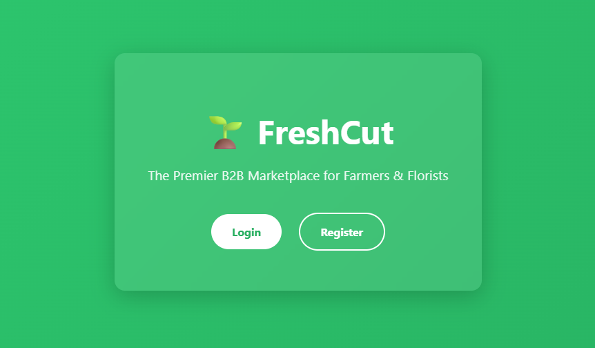
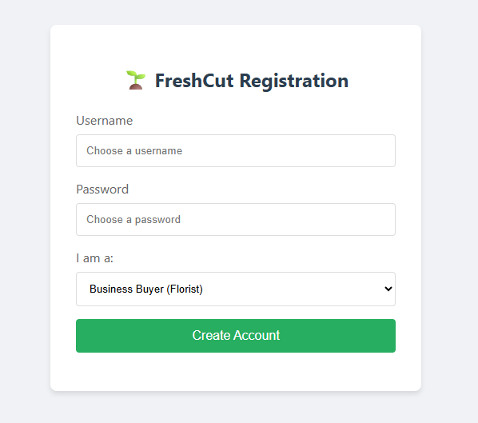
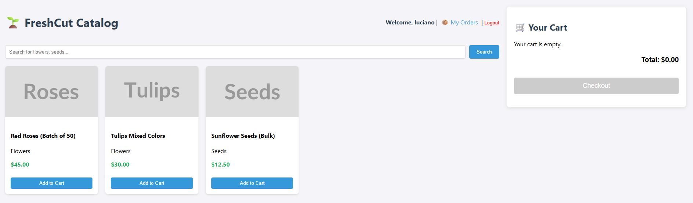
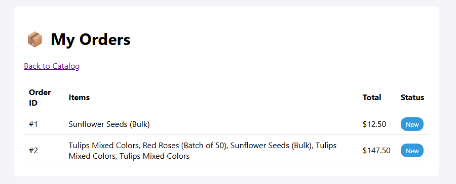
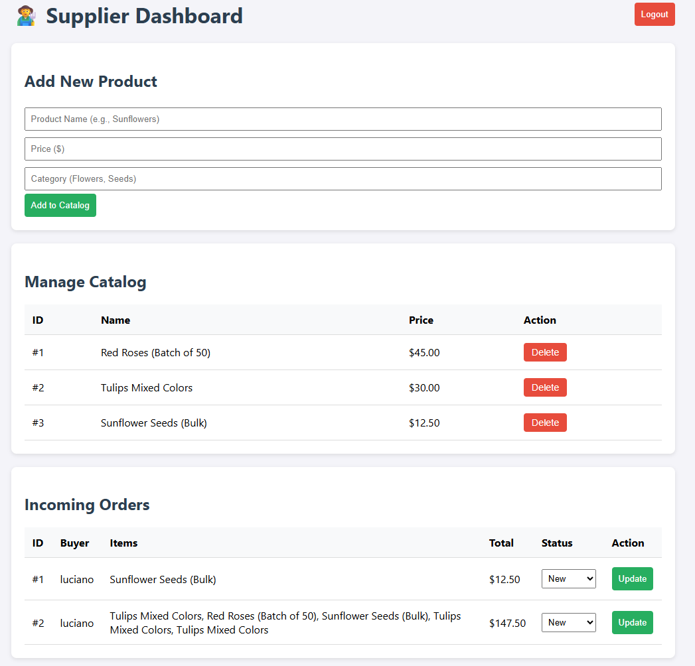

# FreshCut B2B Platform



FreshCut is a digital marketplace connecting farm suppliers (Farmers) with business buyers (Florists). This repository contains the implementation of the core platform features, including a full CI/CD pipeline and automated testing.

## 🎥 Live Demo & Video
**[Click here to watch the End-to-End Automated Demo (Video)](docs/assets/demo.webm)**

*(This video was automatically generated by Playwright testing suite)*

---

## 🚀 Key Features & Screenshots

### 1. User Onboarding
Role-based registration allows users to sign up as **Buyers** or **Suppliers**, redirecting them to the appropriate dashboard.



### 2. Buyer Experience (Florists)
Buyers can browse the catalog, search for products, manage their cart, and track order status.

**Product Catalog & Shopping Cart:**


**Order History Tracking:**


### 3. Supplier Experience (Farmers)
Suppliers have a dedicated dashboard to add products, remove items, and update order statuses (New -> Processing -> Completed).



---

## 🛠️ Tech Stack
-   **Runtime:** Node.js
-   **Framework:** Express.js
-   **Frontend:** HTML5, CSS, Vanilla JS
-   **Testing:** Jest (Unit/Integration)
-   **CI/CD:** GitHub Actions, Render.com

## 📦 Installation & Setup

1.  **Clone the repository:**
    ```bash
    git clone https://github.com/lucimoro94/freshcut-b2b-platform.git
    cd freshcut-b2b-platform
    ```

2.  **Install dependencies:**
    ```bash
    npm install
    ```

3.  **Run the application:**
    ```bash
    npm start
    ```
    The server will start on `http://localhost:3000`.

## ✅ Running Tests
This project uses a CI/CD pipeline. To run tests locally:
```bash
npm test             # Run Jest Unit/Integration Tests
```
