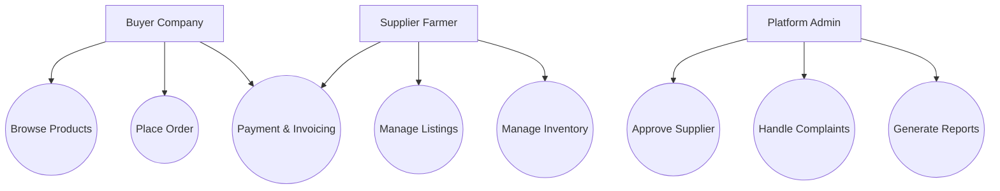

# Use Case Diagram — FreshCut B2B Platform

```mermaid
graph TB
  A[Buyer Company] --> UC1((Browse Products))
  A --> UC2((Place Order))
  B[Supplier Farmer] --> UC3((Manage Listings))
  B --> UC4((Manage Inventory))
  C[Platform Admin] --> UC5((Approve Supplier))
  C --> UC6((Handle Complaints))
  C --> UC7((Generate Reports))
  A --> UC8((Payment & Invoicing))
  B --> UC8
```
